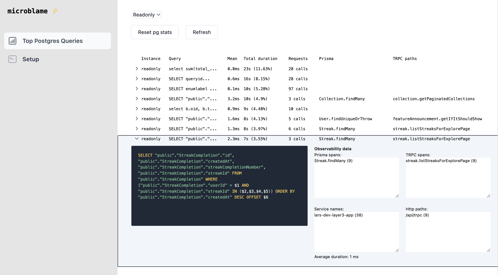

# MicroBlame

MicroBlame lets you pair data from `pg_stat_statements` with observability data to help you understand find slow db queries and where they are coming from.



## Installation

Add `PG_MAIN_DATABASE_URI` and `PG_READ_DATABASE_URI` to a `.env` file.

Make sure the `pg_stat_statements` extension is installed and the user has access to query it.

```
CREATE EXTENSION pg_stat_statements
```

(Optional) If you want to reset the pg_stat_statements data through the UI, you need to grant the user access to the `pg_stat_statements_reset` function.

```
GRANT EXECUTE ON FUNCTION pg_stat_statements_reset TO your_user;
```

Then run:

```bash
docker compose up
```

(optional) send traces to the `:4318/v1/traces` endpoint from your application to get more context on the queries.

The frontend is available at `http://localhost:3004`.
